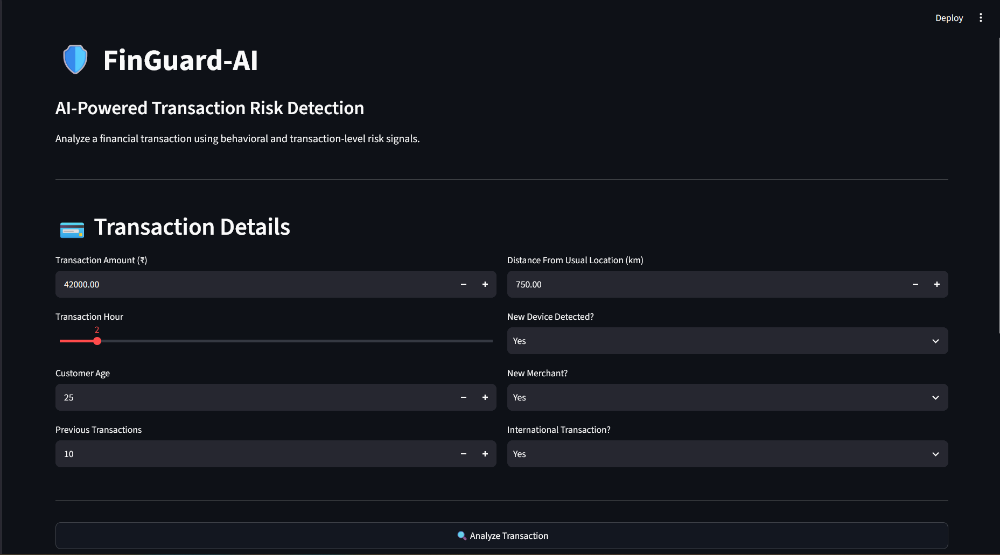
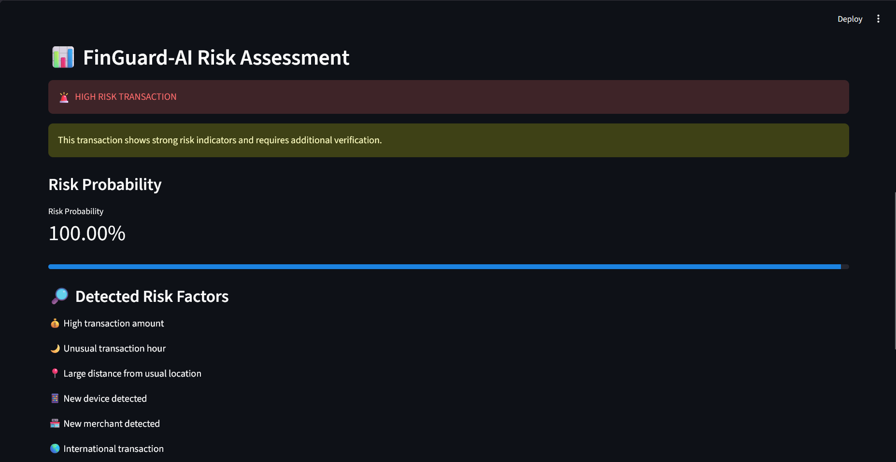
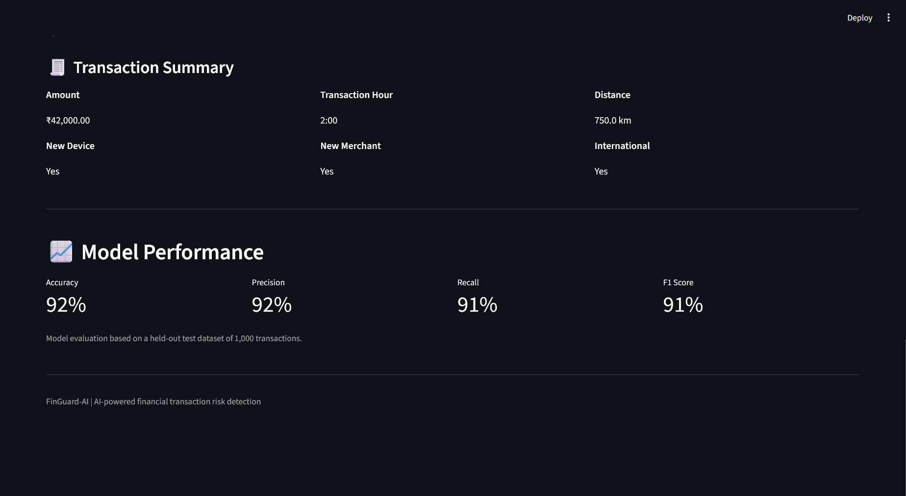

\# 🛡️ FinGuard-AI


\## AI-Powered Financial Transaction Risk Detection


FinGuard-AI is a machine-learning-based financial transaction risk detection system designed to identify potentially suspicious transactions using transaction and behavioral indicators.


The system uses a Random Forest classification model and an interactive Streamlit dashboard to analyze transactions and estimate their risk probability.


\---


\## 🚨 Problem Statement


Financial fraud and suspicious transactions can cause significant financial losses and reduce customer trust.


FinGuard-AI explores how machine learning can help identify potentially risky transactions by combining multiple transaction and behavioral signals.


\---


\## 💡 Solution


FinGuard-AI analyzes:


\- Transaction amount

\- Transaction hour

\- Customer age

\- Previous transactions

\- Distance from usual location

\- New device detection

\- New merchant detection

\- International transaction status


These features are processed by a Random Forest classifier to estimate transaction risk.


\---


\## ✨ Key Features


\- 🤖 Machine-learning-based risk detection

\- 📊 Risk probability estimation

\- 🚨 LOW / MEDIUM / HIGH risk classification

\- 🔎 Risk-factor identification

\- 🖥️ Interactive Streamlit dashboard

\- 📈 Model performance metrics

\- 💳 Real-time transaction analysis


\---


\## 🏗️ System Architecture


```text

User Transaction

&#x20;      │

&#x20;      ▼

Streamlit Dashboard

&#x20;      │

&#x20;      ▼

Transaction Features

&#x20;      │

&#x20;      ▼

Random Forest Model

&#x20;      │

&#x20;      ▼

Risk Probability

&#x20;      │

&#x20;      ▼

Risk Classification

&#x20;      │

&#x20;      ▼

Risk Factors + Alert
---

## 🖥️ Interactive Dashboard

The Streamlit dashboard allows users to enter transaction information and receive an immediate risk assessment.

### Dashboard Features

- Interactive transaction input
- AI-powered risk prediction
- Risk probability
- HIGH / MEDIUM / LOW risk classification
- Detected risk factors
- Transaction summary
- Model performance information
- Confusion matrix
- FinGuard-AI branding

### 📸 Dashboard Preview



### 🚨 Risk Assessment



### 📊 Model Performance



---

